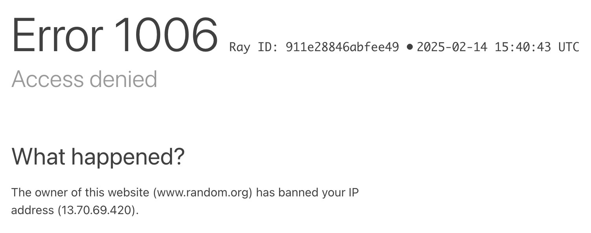

# 🥸 Szpaj - game of spies with balanced randomness

## Problem

In a spies game, spies are randomly picked from the players. The problem is that the randomness is not balanced. Some players are picked more often than others. Yet another issue is that existing solutions are overwhelmingly filled with ads and are not open-source, eventually making player a product without a choice.

## Solution

To build a game of spies with randomness balanced with weights. Each player has a weight that determines how often they are picked as a spy.

## Bonus

- open-source
- free of ads
- can be played on any device with a browser
- built with modern web technologies and optimized for performance

## Development process

### 1st iteration:

Build some UI and use random.org api for a true randomness. On the way I've also realized that pseudo randomness isn't a problem, the problem is that it's not balanced. But then...

...random.org banned my IP for too many requests

### 2nd iteration:

Since random.org wasn't an option anymore, I've had to figure out a way to balance things out in a way that pseudo randomness would do the job. Problem of balancing randomness is that I didn't have the context of the previous rounds. But if I had... So I came up with an arbitrary number 50. Because not many player teams will play 50 more than rounds at once, so I could just generate 50 rounds up front and then - by shuffling - pick one by one. That way I could balance the randomness. Where's the catch?

### 3rd iteration:

Second iteration approach wasn't really random, because depending on spies picked in e.g. round 1, in round 2 it was predictable who will (definitely) not be a spy. Weighted selection appeared to be a natural solution. Couple minutes later - voilà! - I've had a working game with balanced randomness and - most importantly - good gaming experience.

## Tech stack

- SvelteKit
- Tailwind CSS
- Google Fonts
- Vercel (for hosting)
